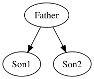
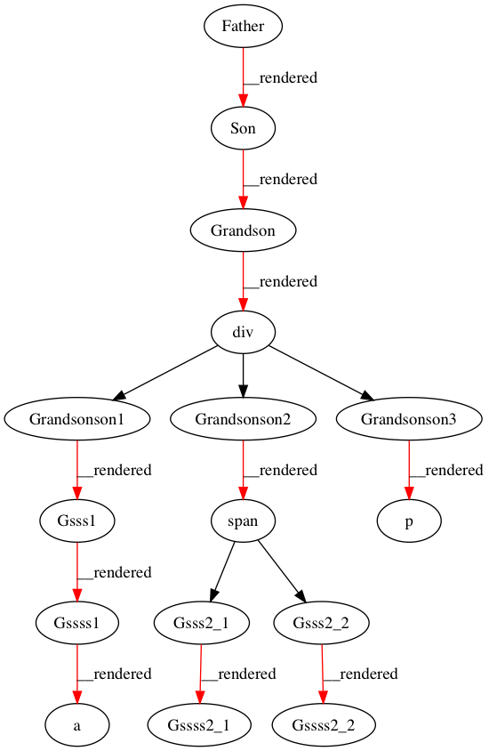
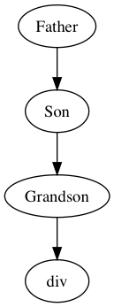

# 从0实现一个tiny react（三）生命周期
在给tinyreact加生命周期之前，先考虑一个 组件实例复用


### 复用组件实例
render函数 只能返回一个根
```jsx harmony
class A extends Component{
    render() {
        return (<B>...</B>)  
    }
}
class C extends Component {
    render() {
        return (
            <div>
               <C1>...</C1>
               <C2>...</C2>
               <C3>...</C3>
            </div>
        )
    }
}
```
所以 最终的组件树一定是类似这种的 (首字母大写的代表组件， div／span／a...代表原生DOM类型)

是绝对不可能 出现下图这种树结构 (与render函数返回单根的特性矛盾)



假如在 Father里面调用 setState？ 按照现在render 函数的做法:
```javascript 1.7
else if (typeof vnode.nodeName == "function") {
    let func = vnode.nodeName
    let inst = new func(vnode.props)
    ...
}
```

1. 新建 Son 实例
2. 新建 Grandson 实例
3. diff 渲染 div

再次setState呢? 好吧， 再来一次：
1. 新建 Son 实例
2. 新建 Grandson 实例
3. diff 渲染 div

第 3步 就是 [(二)](https://segmentfault.com/a/1190000011052656) 讨论的内容， 会用"最少"的dom操作， 来更新dom到最新的状态。 
对于1， 2 每次setState的时候都会新建inst， 在这里是可以复用之前创建好的inst实例的。 

但是如果一个组件 初始渲染为 '\<A/\>', setState 之后渲染为 '\<B/\>' 这种情况呢？ 那inst就不能复用了， 类比一下 DOM 里的 div --> span

so, render代码如下： 
```javascript 1.7
function render (vnode, parent, comp, olddomOrComp) {
    ...
    } else if (typeof vnode.nodeName == "function") {
        let func = vnode.nodeName
        let inst
        if(olddomOrComp && olddomOrComp instanceof func) {
            inst = olddomOrComp
            olddomOrComp.props = vnode.props 
        } else {
            inst = new func(vnode.props)
            comp && (comp.__rendered = inst)
        }

        let innerVnode = inst.render()
        render(innerVnode, parent, inst, inst.__rendered)
    }
    ...
}
```
注意 这里render的第4个参数被重新定义为  olddomOrComp 含义: 之前的老dom 或者老组件实例 。 对应的 最后的 render(innerVnode, parent, inst, inst.__rendered),
对应的， Component里面setState 和 createNewDom方法的修改： 
```javascript 1.7
setState(state) {
    setTimeout(() => {
        ...
        render(vnode, olddom.parentNode, this, this.__rendered)  //传递this.__rendered 作为第四个参数
       
    }, 0)
}


function createNewDom(vnode, parent, comp, olddomOrComp) {
    ...
    if(olddomOrComp) {
        parent.replaceChild(dom, getDOM(olddomOrComp)) // 这里可以替换的DOM元素， 需要找到olddomOrComp 对应的DOM元素
    } else {
        parent.appendChild(dom)
    }
    ...
}
```
重新考虑 Father里面调用 setState。 此时已经不会创建新实例了。

那么 假如现在对 Grandson调用setState呢？ 很不幸， 我们需要创建Granssonson1, Granssonson2, Granssonson3， 调用几次， 我们就得跟着新建几次。 
上面的复用方式 并没有解决这个问题, 之前 __rendered 引用链 到 dom就结束了, 如下图。 

把__rendered这条链 完善吧！！

首先 对__rendered 重新定义如下:
1. 当X 是组件实例的时候， __rendered 为X渲染出的 组件实例 或者 dom元素
2. 当X 是dom元素的时候， __rendered 为一个数组， 是X的子组件实例 或者 子dom元素
```
Father --__rendered--> Son  --__rendered--> Grandson --__rendered--> div --__rendered--> [Granssonson1,  Granssonson2, Granssonson3,]
```

在dom 下创建 "直接子节点" 的时候。 需要把这个纪录到dom.__rendered 数组中。 或者说， 如果新建的一个dom元素／组件实例  是dom的 "直接子节点"， 那么需要把它纪录到
parent.__rendered 数组中。 那怎么判断 创建出来的是 "直接子节点" 呢？ 答案是render 第3个参数 comp为null的， 很好理解， comp的意思是 "谁渲染了我"
很明显， 只有 dom下的 "直接子节点" comp才是null， 其他的情况， comp肯定不是null， 比如 Son的comp是Father， Gsss1
的comp是Grandsonson1。。。

当setState重新渲染的时候， 如果老的dom／inst没有被复用， 则应该用新的dom／inst 替换
<br/> 
1. 创建dom的时候。 olddomOrComp 存在的时候 替换
```javascript 1.7
function createNewDom(vnode, parent, comp, olddomOrComp) {
    ...
    if (comp) {
        comp.__rendered = dom
    } else {
        if (olddomOrComp) {
            parent.__rendered.replace(inst, olddomOrComp)
        } else {
            parent.__rendered.push(dom)
        }
    }
    ...
}
```
2. diffDOM 的时候： a. remove多余的节点； b. render子节点的时候olddomOrComp = olddom.__rendered[i]
```javascript 1.7
function diffDOM(vnode, parent, comp, olddom) {
    ...
    olddom.__rendered.slice(vnode.children.length)
        .forEach(element => {
            olddom.removeChild(getDOM(element))
        })

    olddom.__rendered = olddom.__rendered.slice(0, vnode.children.length)
    for(let i = 0; i < vnode.children.length; i++) {
        render(vnode.children[i], olddom, null, olddom.__rendered[i])
    }
    olddom.__vnode = vnode
}
```
3. 组件实例类似 createNewDom
```javascript 1.7
else if (typeof vnode.nodeName == "function") {
    ...
    if(olddomOrComp && olddomOrComp instanceof func) {
        inst = olddomOrComp
    } else {
        inst = new func(vnode.props)

        if (comp) {
            comp.__rendered = inst
        } else {
            if (olddomOrComp) {
                parent.__rendered.replace(inst, olddomOrComp)
            } else {
                parent.__rendered.push(inst)
            }
        }
    }
    ...
}
```
由于js的Array不提供replace（可以使用indexOf + splice实现， 但是每次查找都是O(n)）， 所以我们提供 RenderedHelper 类来提供（O(1)的时间复杂度来实现replace）：
```jsx harmony
class RenderedHelper {
    constructor(arr) {
        this.__arr = arr || []
    }

    replaceNullPush(now, old) {
        if (!old) {
            now.__renderedHelperTag = `${this.__arr.length}`
            this.__arr.push(now)
        } else {
            if (this.__arr[old.__renderedHelperTag] === old) {
                now.__renderedHelperTag = old.__renderedHelperTag
                this.__arr[now.__renderedHelperTag] = now
            } else {
                now.__renderedHelperTag = `${this.__arr.length}`
                this.__arr.push(now)
            }
        }
    }

    slice(start, end) {
        return this.__arr.slice(start, end)
    }
}
```
所以完整的代码：
```jsx harmony
function render(vnode, parent, comp, olddomOrComp) {
    let dom
    if(typeof vnode === "string" || typeof vnode === "number" ) {
        if(olddomOrComp && olddomOrComp.splitText) {
            if(olddomOrComp.nodeValue !== vnode) {
                olddomOrComp.nodeValue = vnode
            }
        } else {
            dom = document.createTextNode(vnode)
            parent.__rendered.replaceNullPush(dom, olddomOrComp) //comp 一定是null

            if(olddomOrComp) {
                parent.replaceChild(dom, getDOM(olddomOrComp))
            } else {
                parent.appendChild(dom)
            }
        }
    } else if(typeof vnode.nodeName === "string") {
        if(!olddomOrComp || olddomOrComp.nodeName !== vnode.nodeName.toUpperCase()) {
            createNewDom(vnode, parent, comp, olddomOrComp)
        } else {
            diffDOM(vnode, parent, comp, olddomOrComp)
        }
    } else if (typeof vnode.nodeName === "function") {
        let func = vnode.nodeName
        let inst
        if(olddomOrComp && olddomOrComp instanceof func) {
            inst = olddomOrComp
            inst.props = vnode.props
        } else {
            inst = new func(vnode.props)

            if (comp) {
                comp.__rendered = inst
            } else {
                parent.__rendered.replaceNullPush(inst, olddomOrComp)
            }
        }

        let innerVnode = inst.render()
        render(innerVnode, parent, inst, inst.__rendered)
    }
}

function createNewDom(vnode, parent, comp, olddomOrComp) {
    let dom = document.createElement(vnode.nodeName)

    dom.__rendered = new RenderedHelper()  // 创建dom的 设置 __rendered 引用
    dom.__vnode = vnode

    if (comp) {
        comp.__rendered = dom
    } else {
        parent.replaceNullPush(dom, olddomOrComp)
    }

    setAttrs(dom, vnode.props)

    if(olddomOrComp) {
        parent.replaceChild(dom, getDOM(olddomOrComp))
    } else {
        parent.appendChild(dom)
    }

    for(let i = 0; i < vnode.children.length; i++) {
        render(vnode.children[i], dom, null, null)
    }
}

function diffDOM(vnode, parent, comp, olddom) {
    const {onlyInLeft, bothIn, onlyInRight} = diffObject(vnode.props, olddom.__vnode.props)
    setAttrs(olddom, onlyInLeft)
    removeAttrs(olddom, onlyInRight)
    diffAttrs(olddom, bothIn.left, bothIn.right)


    olddom.__rendered.slice(vnode.children.length)
        .forEach(element => {
            olddom.removeChild(getDOM(element))
        })

    const __renderedArr = olddom.__rendered.slice(0, vnode.children.length)
    olddom.__rendered = new RenderedHelper(__renderedArr)
    for(let i = 0; i < vnode.children.length; i++) {
        render(vnode.children[i], olddom, null, __renderedArr[i]) // olddomOrComp 存在olddom.__rendered
    }
    olddom.__vnode = vnode
}
```

现在 __rendered链 完善了， Father／ Gransson 的setState, 都会先去尝试复用 组件实例。 

### 生命周期
前面讨论的__rendered 和生命周期有 什么关系呢？ 起码constructor 只调用一次了。。。

        


组件渲染前后， 我们怎么干预插入自己的操作呢？react提供了丰富的生命周期方法。
 
同样的，我们将给tinyreact加上以下的生命周期， 这些生命的意义和react对应的生命周期是完全等效的： 
1. componentWillMount
2. componentDidMount
3. componentWillReceiveProps
4. shouldComponentUpdate
5. componentWillUpdate
6. componentDidUpdate
7. componentWillUnmount

在[(二)](https://segmentfault.com/a/1190000011052656) 里面 我们对 DOM进行了 复用。 对于组件实例，是每次都会去new一个对象
```javascript 1.7
else if (typeof vnode.nodeName == "function") {
        ...
        let inst = new func(vnode.props)
        ...
    }
```
其实， inst有时是不需要重新创建的。 只需要从新设置 props， state， 然后render。 考虑下面的例子
```javascript 1.7
class SubA extends Component {
    render() {
        return <div>subA</div>
    }
}
class SubB extends Component {
    render() {
        return <div>subB</div>
    }
}

class App extends Component {
    constructor(props) {
        super(props)
        this.state = {
            num: 0
        }
    }
    
    render() {
        return (
            <div onClick={e =>{
                this.setState({
                    num: this.state.num + 1
                })
            }}>
               {this.state.num > 1 ? <SubA/> : <SubB/> } 
            </div>
        )
    }
}
```
初始的是SubA。 点击一次SubA。 再次点击， 以及之后的所有点击 都是SubB。 所以这里其实 只需要 创建两个实例(SubA, SubB各一个) 就够了， 
而不是现在我们每点击一次 都会创建一个实例。 

所以需要一个机制， 去获取上一次渲染的inst， 让我们可以避开重新渲染。 还记得[(一)](https://segmentfault.com/a/1190000010822571) 怎么寻找 "组件渲染的dom元素" 的方法的吗？


__rendered 引用纪录了 组件的实例链， 链的最终是DOM元素， 所以根据这个__rendered的引用，纪录了渲染的inst

类似DOM的复用， 对相同类型的inst, 我们不新建实例。
```javascript 1.7
function render (vnode, parent, comp, olddomOrComp) {
    ...
    } else if (typeof vnode.nodeName == "function") {
        let func = vnode.nodeName
        let inst
        if(olddomOrComp && olddomOrComp instanceof func) {
            inst = olddomOrComp
        } else {
            inst = new func(vnode.props)
            comp && (comp.__rendered = inst)
        }

        let innerVnode = inst.render()
        render(innerVnode, parent, inst, inst.__rendered)
    }
    ...
}    
```
这里， 注意render 第4个参数 olddom --> olddomOrComp, 以及最后的render(innerVnode, parent, inst, inst.__rendered) 。 
这样 相同的组件实例就可以重复使用。 对应的setState部分, createNewDom的修改
```javascript 1.7
setState(state) {
    setTimeout(() => {
        ...
        render(vnode, olddom.parentNode, this, this.__rendered) // 传递this.__rendered 作为第四个参数
    }, 0)
}

function createNewDom(vnode, parent, comp, olddomOrComp) {
    ...
    if(olddomOrComp) {
        parent.replaceChild(dom, getDOM(olddomOrComp)) // 这里可以替换的DOM元素， 需要找到olddomOrComp 对应的DOM元素
    } else {
        parent.appendChild(dom)
    }
    ...
}
```

继续考虑下图的组件渲染： 


对应Father -> Son -> Grandson 是可以根据__rendered 来引用的， <br/>
但是 这里的 Grandsonson1, Grandsonson2, Grandsonson3 怎么处理呢？


 


